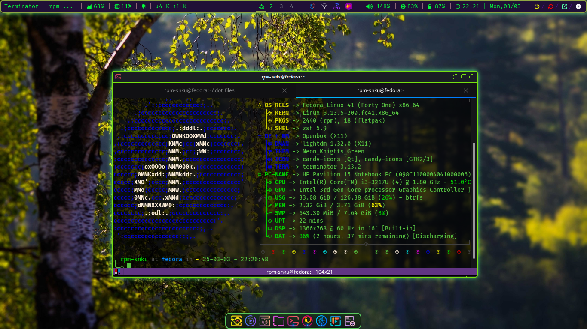

# .dot_files

This repository is for storing my configuration files, dotfiles, and other custom settings for my Linux desktop environment. This setup features Openbox as the window manager, Polybar for the status bar, Plank as the dock, and Fastfetch for system information.

## Screenshots

Here is screenshots showcasing my desktop environment and configurations:

**all components like polybar, plank, waybar, rofi are independently customized.**

### Desktop Environment


*This screenshot shows my customized Openbox desktop environment with Polybar at the top and Plank dock at the bottom.*
**This is OpenBox on fedora**


## Details

- **Dotfiles Included:** This repository includes configuration files for various applications such as:
  - **Openbox:** Configuration files for window management.
  - **Polybar:** Custom configuration for the status bar, located in `.config/polybar/`.
  - **Plank:** Configuration files for the dock, located in `.config/plank/`.
  - **Fastfetch:** Configuration for displaying system information.

- **Usage:** To use these dotfiles, you can clone this repository and symlink the files to your home directory. For example:
  ```bash
  git clone https://github.com/your-username/.dot_files.git
  cd .dot_files
  ln -s $(pwd)/openbox ~/.config/openbox
  ln -s $(pwd)/polybar ~/.config/polybar
  ln -s $(pwd)/plank ~/.config/plank
