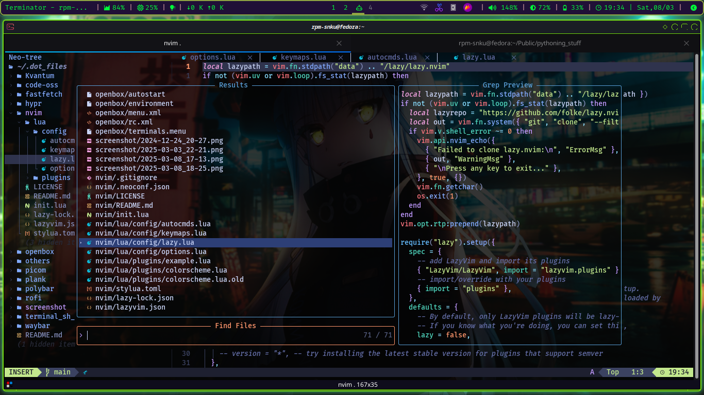

# .dot_files

This repository is for storing my configuration files, dotfiles, and other custom settings for my Linux desktop environment. This setup features Openbox as the window manager, Polybar for the status bar, Plank as the dock, and Fastfetch for system information.

## Screenshots

Here is screenshots showcasing my desktop environment and configurations:

**all components like polybar, plank, waybar, rofi are independently customized.**

### Desktop Environment


*This screenshot shows my customized Openbox desktop environment with Polybar at the top and Plank dock at the bottom.*
**This is OpenBox on fedora**

### Neovim custom (\*_*)

*lazyvim configuration .*


## Details

- **Dotfiles Included:** This repository includes configuration files for various applications such as:
  - **Openbox:** Configuration files for window management.
  - **Polybar:** Custom configuration for the status bar, located in `.config/polybar/`.
  - **Plank:** Configuration files for the dock, located in `.config/plank/`.
  - **Fastfetch:** Configuration for displaying system information.

<br>

---
# Setting Up
**Usage:** To use these dotfiles, you can clone this repository and symlink the files to your home directory. 

Clone the repo an enter into it
  ```bash
  git clone https://github.com/Shnku/.dot_files.git
  cd .dot_files
  ```
## Setting Up OpenBox-WM x11
This is actually **`openbox wm`** configuration on **`*fedora*`** which contains using **lxqt-desktop** base -

```bash
sudo dnf install git polybar rofi plank picom dunst nvim fastfetch copyq flameshot
```

- With **vscodium** or **code-oss**(garuda configured)
- **lazyvim** neovim config
- **polybar** and **plank**-theme dock  with **rofi**search 
- **picom** for compositing
- **dunst** as notification daemon
- **copyq** as clipboard and **flameshot** as screenshot utility
- custom **fastfetch**
- fish like **zsh** config with **starship** prompt

```bash                             
  ln -s $(pwd)/openbox ~/.config/openbox
  ln -s $(pwd)/polybar ~/.config/polybar
  ln -s $(pwd)/rofi ~/.config/rofi
  ln -s $(pwd)/picom ~/.config/picom
  ln -s $(pwd)/plank ~/.local/share/plank
  ln -s $(pwd)/fastfetch ~/.config/fastfetch
  ln -s $(pwd)/nvim ~/.config/nvim
```

### Essential dependecies for polybar
- **brightnessctl** for custom brightness control module. because default backlight module doesnot work
  > `sudo dnf install brightnessctl`
- JetBrains used as first font else default to noto sans **Nerd-Font** (also **fontawesome**) required for showing icons.
  >from fedora pakage manger..<br>
  > `sudo dnf install  jetbrains-mono-fonts-all cascadia-code-nf-fonts`


#### manual installation script for nerd-font
```bash
cd ~/.local/share/fonts; 
for i in FiraCode Inconsolata Cascedia AnonymousPro JetBrainsMono ; do                                                              
  curl -OL "https://github.com/ryanoasis/nerd-fonts/releases/latest/download/${i}.tar.xz"                                 
done;ls;
for file in *.tar.xz; do                                                                                                              
    tar xvf "$file"                                                                                                          
done;ls;
rm *.tar.xz;ls;
fc-cache -fv #update font cache

```                                                     

#### font-awesome and material design related **icon font** 
```bash
#material design icon my preferance 
sudo dnf install  material-icons-fonts 

#for fontawesome not in fedora repo
cd ~/.local/share/fonts;
curl -OL https://github.com/FortAwesome/Font-Awesome/releases/download/6.7.2/fontawesome-free-6.7.2-desktop.zip;
unzip fontawesome-free-6.7.2-desktop.zip;
cd fontawesome-free-6.7.2-desktop;ls;
mv otfs/* ../;cd..;
rm *.zip;rm -rf fontawesome-free-6.7.2-desktop;
fc-cache -fv

```

### Essential for setting **Qt-themes** 
qt themes not seted via lxqt-apperance. <br> 
to do so add this to `.profile` 
```bash
sudo dnf install qt6ct
echo "export QT_QPA_PLATFORMTHEME=qt6ct" >> .profile
```

### Touchpad Input Gesture fix
**Tap to click** not work even if selected via lxqt-mouse settings ... so need to do this :
```bash
sudo nano /usr/share/X11/xorg.conf.d/40-libinput.conf
# add these ..
Section "InputClass"
        Identifier "libinput touchpad catchall"
        MatchIsTouchpad "on"
        MatchDevicePath "/dev/input/event*"
        Driver "libinput"
        Option "Tapping" "on" #this line 
EndSection
```

## zsh fish-like setup with starship 
**NOTE :** This is Done in Fedora
```bash
#install oh-my-zsh
sh -c "$(curl -fsSL https://raw.githubusercontent.com/ohmyzsh/ohmyzsh/master/tools/install.sh)";
#install starship custom prompt 
curl -sS https://starship.rs/install.sh | sh;
```
Install **zsh plugins** `autocomplete` (also available in dnf), `autosuggation`, `history search substring` .
```bash
git clone https://github.com/zsh-users/zsh-completions.git \
  ${ZSH_CUSTOM:-${ZSH:-~/.oh-my-zsh}/custom}/plugins/zsh-completions;
fpath+=${ZSH_CUSTOM:-${ZSH:-~/.oh-my-zsh}/custom}/plugins/zsh-completions/src;
autoload -U compinit && compinit;
source "$ZSH/oh-my-zsh.sh";
#autosuggation .. aval via dnf
git clone https://github.com/zsh-users/zsh-autosuggestions ${ZSH_CUSTOM:-~/.oh-my-zsh/custom}/plugins/zsh-autosuggestions;
#history substring search
git clone https://github.com/zsh-users/zsh-history-substring-search ${ZSH_CUSTOM:-~/.oh-my-zsh/custom}/plugins/zsh-history-substring-search;
```
Now, *copy* or *symlink*<br>
plugins preactivated in `.zshrc`. and starship is preconfigured
```bash
ln -s $(pwd)/terminal_sh_config/.zshrc ~/.zshrc; 
ln -s $(pwd)/terminal_sh_config/starship.toml ~/.config/starship.toml;
```

